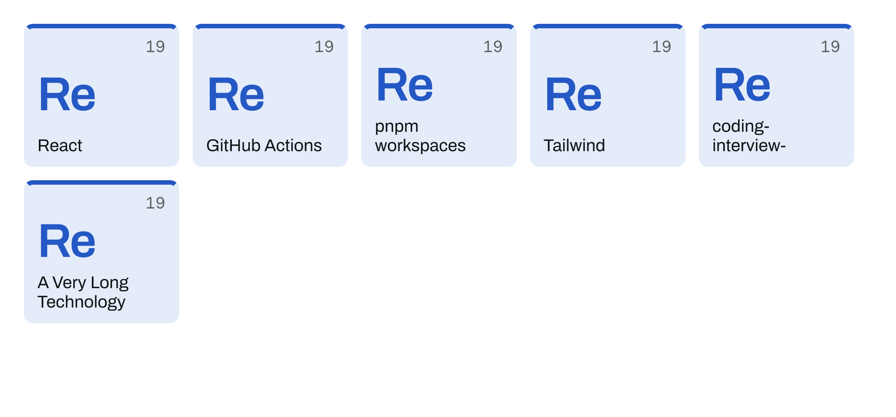
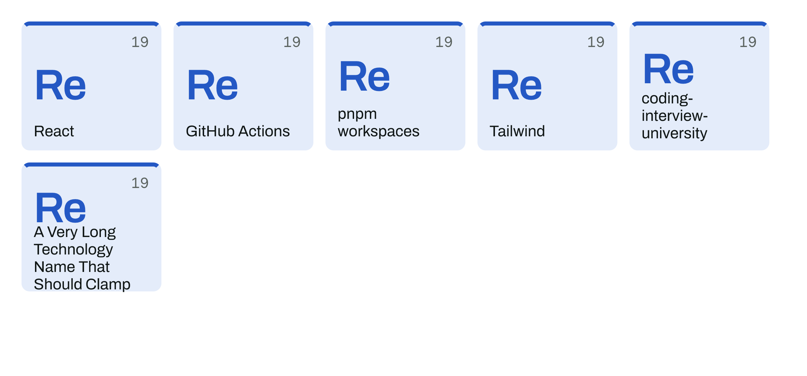
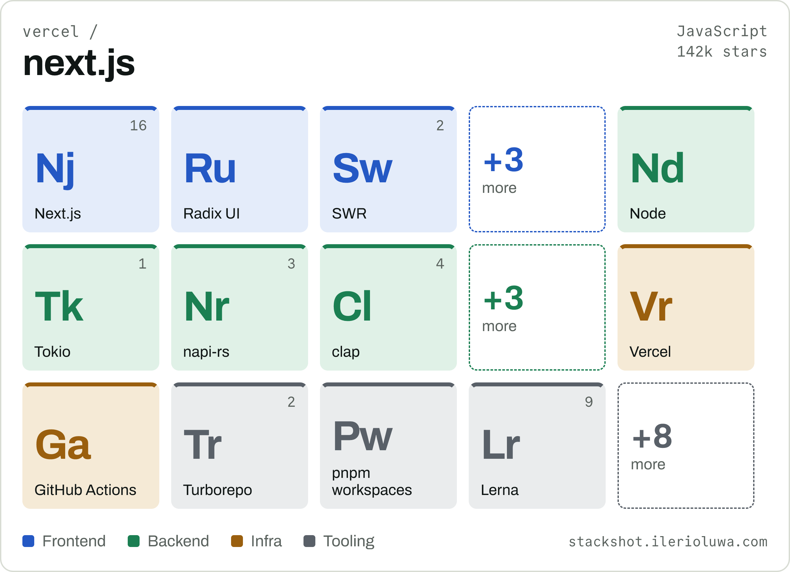
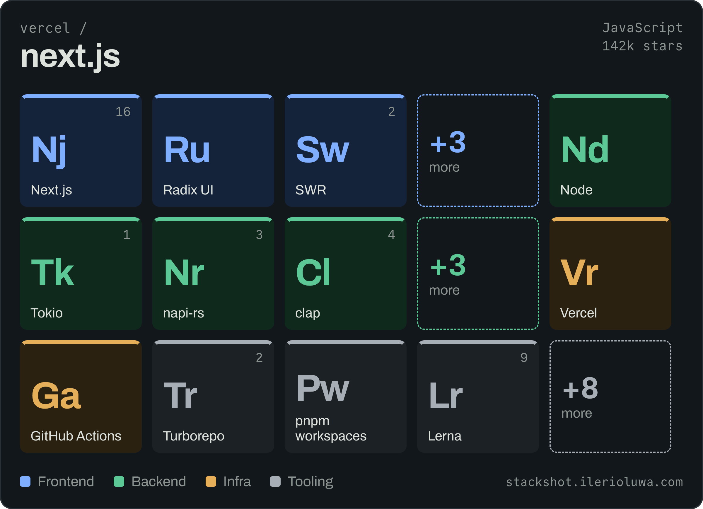
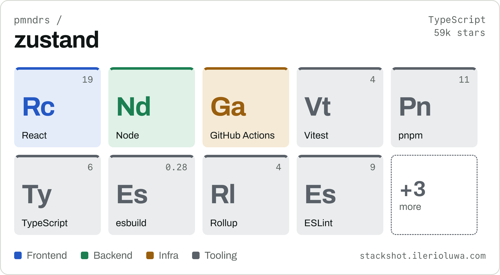
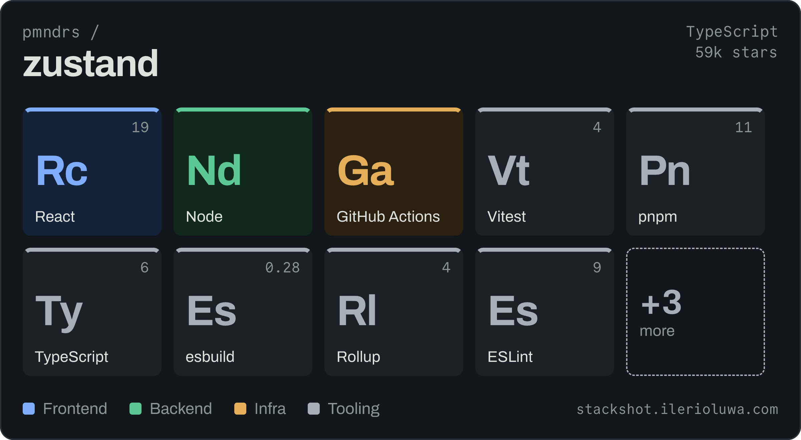
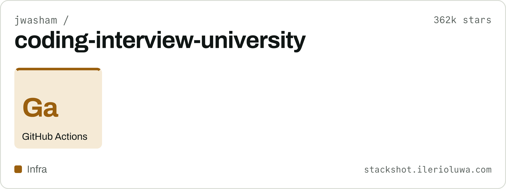
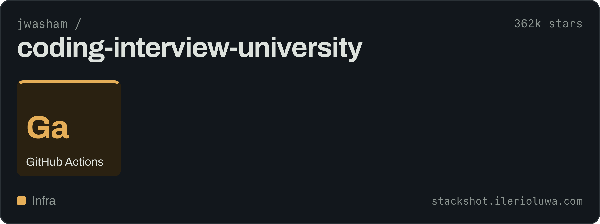

# Phase 0 — de-risking the card styles

Four questions that could have invalidated a style, answered before building one. Images
here are throwaway renders from a scratchpad prototype, not the real renderer.

**Open this file in the GitHub mobile app.** That is the legibility check, on the surface
that governs: the app shows a README image at ~350px, which is 0.29 px per card unit.

---

## 1. Does Satori clamp text to two lines? Yes

Tiles names use `maxHeight` + `overflow: hidden` for a two-line clamp, which the design
handoff flagged as unverified. Satori honours both.

| | |
|---|---|
|  |  |
| `maxHeight: 52, overflow: hidden` | no clamp |

Left: `coding-interview-university` cuts after two lines. Right, without it: the same name
takes three lines and the longest one **escapes the tile entirely**, painting over the
rounded corner. So the clamp is load-bearing, not decorative, and no code-side
measure-and-truncate is needed.

It clamps without an ellipsis, which is a difference from the repo name's behaviour
(GOTCHAS 039). It does not matter in practice: across all 225 map entries the longest
`display` is `styled-components` at 17 characters and the median is 6, so two lines is
never exceeded by real data. The clamp is a guard against a future entry, not a routine
behaviour. Phase 2's contact sheet renders all 225 and is the check.

## 2. Do Commit Mono's box-drawing glyphs exist? Yes, in both weights

Terminal draws its layer tree with `├── └──`. Parsed from the shipped `cmap` tables:

```
CommitMono-400-Regular.ttf   1175 codepoints
CommitMono-700-Regular.ttf   1175 codepoints
  U+2500 ─   U+2502 │   U+251C ├   U+2514 └   U+2588 █   U+25AE ▮      all present
```

Terminal is not blocked.

## 3. What do the designs' font weights cost? One new file

The four styles ask for Archivo 500/700 and Commit Mono 600; we shipped Archivo 400/600
and Commit Mono 400/700. Resolved by shipping **Archivo Bold** and remapping the rest.
See GOTCHAS 047.

`Archivo-Bold.ttf` is Omnibus-Type v2.001 — byte-checked as TrueType, `usWeightClass` 700,
**no `ltag` table** (GOTCHAS 015's trap), and the same version string as the Regular and
SemiBold already committed. Adding it left all 14 committed render hashes byte-identical,
because nothing asks for 700 yet, so no `RENDER_VERSION` bump.

## 4. How big is a Tiles card, and does it read at 0.29?

Content-height, so it varies with the stack — and **capped at three rows**, which is what
keeps it from becoming a portrait block taller than the screen reading it. Measured at
1200 units wide, after the cap:

| Repo | Rows | Height | PNG | base64, both themes |
|---|---|---|---|---|
| vercel/next.js | 3 | 869 | 191 KB | 495 KB |
| mastodon/mastodon | 3 | 869 | 186 KB | 482 KB |
| pmndrs/zustand | 2 | 659 | 142 KB | 368 KB |
| jwasham/coding-interview-university | 1 | 449 | 67 KB | 174 KB |
| github/gitignore | 1 | 449 | 54 KB | 139 KB |

The cap took next.js and mastodon from 1289 units to **869**, near the Datasheet's fixed
800, and the average from ~452 KB per stack to **~332 KB** against the Datasheet's ~275 KB.
The 256 MB tier holds roughly **790 stacks** in Tiles alone. With the `png:` TTL at 7 days
and Upstash eviction on, the cache degrades under pressure rather than stopping.

### The phone check: passed

**Read in the GitHub mobile app on 2026-09-29.** The symbols were legible — in this table,
where the two themes sit side by side and each image is therefore *smaller* than a README
would render it. That is the verdict the direction needed, from the surface that governs.

| light | dark |
|---|---|
|  |  |
|  |  |
|  |  |

The names are 23 units — 6.7px at 0.29, below the 8.75px floor DESIGN set for anything
that must be read — and that is deliberate. Symbols are 64 units (18.6px) and carry the
card at thumbnail size; names are for up close. ADR-0029 records the reversal.

The last row is the sparsest shape the layout has to hold: one tile, no language, a
26-character name. It reads as a spec sheet with one entry rather than as a broken card.

The symbols in these images come from a crude prototype generator and several are wrong —
`Jest → Js` reads as JavaScript, `Next.js → Nj` should be `Nx`. That is the argument for
Phase 2's review pass over all 225, not a reason to distrust the layout.

## Also found: Tiles misses five-across by four units

Five tiles need 1112 units; the design's padding leaves 1108, so it wraps to four columns
and the card grows a row. This is latent in the design file too, which misses it by 2px at
its 600px draw. Setting the card's padding to **32 — already `CARD.padding`, and on
DESIGN's spacing scale, where the design's 44 is not** — gives five across. All numbers
above are at 32, with the three-row cap. GOTCHAS 048.
