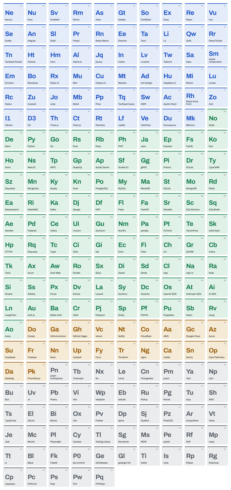
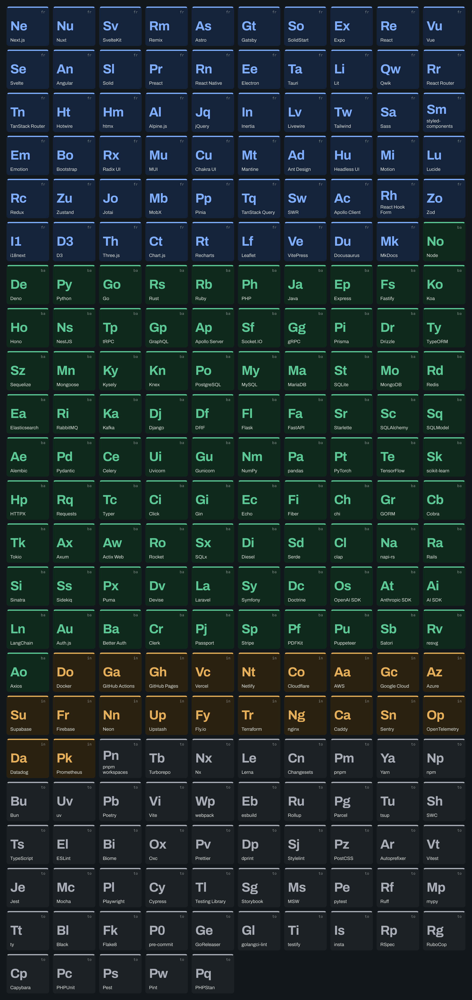

# Phase 0 — de-risking the card styles

Four questions that could have invalidated a style, answered before building one. Images
here are throwaway renders from a scratchpad prototype, not the real renderer.

**Open this file in the GitHub mobile app.** That is the legibility check, on the surface
that governs: the app shows a README image at ~350px, which is 0.29 px per card unit.

---

## 1. Does Satori clamp text to two lines? Yes

Tiles names use `maxHeight` + `overflow: hidden` for a two-line clamp, which the design
handoff flagged as unverified. Satori honours both.

| | |
|---|---|
|  |  |
| `maxHeight: 52, overflow: hidden` | no clamp |

Left: `coding-interview-university` cuts after two lines. Right, without it: the same name
takes three lines and the longest one **escapes the tile entirely**, painting over the
rounded corner. So the clamp is load-bearing, not decorative, and no code-side
measure-and-truncate is needed.

It clamps without an ellipsis, which is a difference from the repo name's behaviour
(GOTCHAS 039). It does not matter in practice: across all 225 map entries the longest
`display` is `styled-components` at 17 characters and the median is 6, so two lines is
never exceeded by real data. The clamp is a guard against a future entry, not a routine
behaviour. Phase 2's contact sheet renders all 225 and is the check.

## 2. Do Commit Mono's box-drawing glyphs exist? Yes, in both weights

Terminal draws its layer tree with `├── └──`. Parsed from the shipped `cmap` tables:

```
CommitMono-400-Regular.ttf   1175 codepoints
CommitMono-700-Regular.ttf   1175 codepoints
  U+2500 ─   U+2502 │   U+251C ├   U+2514 └   U+2588 █   U+25AE ▮      all present
```

Terminal is not blocked.

## 3. What do the designs' font weights cost? One new file

The four styles ask for Archivo 500/700 and Commit Mono 600; we shipped Archivo 400/600
and Commit Mono 400/700. Resolved by shipping **Archivo Bold** and remapping the rest.
See GOTCHAS 047.

`Archivo-Bold.ttf` is Omnibus-Type v2.001 — byte-checked as TrueType, `usWeightClass` 700,
**no `ltag` table** (GOTCHAS 015's trap), and the same version string as the Regular and
SemiBold already committed. Adding it left all 14 committed render hashes byte-identical,
because nothing asks for 700 yet, so no `RENDER_VERSION` bump.

## 4. How big is a Tiles card, and does it read at 0.29?

Content-height, so it varies with the stack — and **capped at three rows**, which is what
keeps it from becoming a portrait block taller than the screen reading it. Measured at
1200 units wide, after the cap:

| Repo | Rows | Height | PNG | base64, both themes |
|---|---|---|---|---|
| vercel/next.js | 3 | 869 | 191 KB | 495 KB |
| mastodon/mastodon | 3 | 869 | 186 KB | 482 KB |
| pmndrs/zustand | 2 | 659 | 142 KB | 368 KB |
| jwasham/coding-interview-university | 1 | 449 | 67 KB | 174 KB |
| github/gitignore | 1 | 449 | 54 KB | 139 KB |

The cap took next.js and mastodon from 1289 units to **869**, near the Datasheet's fixed
800, and the average from ~452 KB per stack to **~332 KB** against the Datasheet's ~275 KB.
The 256 MB tier holds roughly **790 stacks** in Tiles alone. With the `png:` TTL at 7 days
and Upstash eviction on, the cache degrades under pressure rather than stopping.

### The phone check: passed

**Read in the GitHub mobile app on 2026-09-29.** The symbols were legible — in this table,
where the two themes sit side by side and each image is therefore *smaller* than a README
would render it. That is the verdict the direction needed, from the surface that governs.

| light | dark |
|---|---|
|  |  |
|  |  |
|  |  |

The names are 23 units — 6.7px at 0.29, below the 8.75px floor DESIGN set for anything
that must be read — and that is deliberate. Symbols are 64 units (18.6px) and carry the
card at thumbnail size; names are for up close. ADR-0029 records the reversal.

The last row is the sparsest shape the layout has to hold: one tile, no language, a
26-character name. It reads as a spec sheet with one entry rather than as a broken card.

The symbols in these images come from a crude prototype generator and several are wrong —
`Jest → Js` reads as JavaScript, `Next.js → Nj` should be `Nx`. That is the argument for
Phase 2's review pass over all 225, not a reason to distrust the layout.

## Also found: Tiles misses five-across by four units

Five tiles need 1112 units; the design's padding leaves 1108, so it wraps to four columns
and the card grows a row. This is latent in the design file too, which misses it by 2px at
its 600px draw. Setting the card's padding to **32 — already `CARD.padding`, and on
DESIGN's spacing scale, where the design's 44 is not** — gives five across. All numbers
above are at 32, with the three-row cap. GOTCHAS 048.


---

# Phase 2 — the 225 symbols, for review

Every map entry drawn as a real Tiles tile by `scripts/symbol-sheet.ts`, with the real
fonts and tokens, because the question is whether a symbol reads *on a card* rather than
whether it looks sensible in a table. The small grey label is the layer.

| light | dark |
|---|---|
|  |  |

## How these were chosen

`scripts/symbols.ts` proposes; it does not decide. The ladder is the periodic table's own
rule — the first two letters, or the first plus a later one where that is taken — with
both initials tried first for multi-word names, because `Ga` says GitHub Actions and `Gi`
says nothing.

Two groups are anchored before anything is derived, and neither is taste:

- **The designer's 26 picks**, read off `docs/design/directions/tiles.dc.html`. Where a
  real decision already existed it outranks a heuristic. The ladder had given Tailwind
  `Ti` and webpack `We` while `Tw` and `Wp` sat free, because it takes the first available
  letter in name order rather than the idiomatic one.
- **Languages and runtimes**, because `weight` ranks within a layer and types.ts
  deliberately depresses them — "the header already names the primary language" — which
  has nothing to do with symbols. Without this, sorting by weight hands Python `Pk` and
  Rust `Rg`.

Everything else is allocated in descending `weight`, ties by id. That is a knowingly
imperfect proxy: weight is a within-layer rank, so Gatsby outranks GitHub Actions, which
far more readers will actually see. Allocation really wants frequency across repos, which
we will not have until ADR-0012's counters run.

## What to look at

**One real conflict.** The design asked for `Nx` for Next.js, but `Nx` is the literal name
of another entry in the map. Next.js currently has `Ne`. Both cannot be right.

**Nineteen took a letter that means nothing**, because `P` and `S` are crowded — nine
names begin with P. Each line shows what it wanted and who holds it, since the real choice
is usually a trade rather than an invention:

```
Redux        Rc    wanted Re (react)   Rd (redis)   Ru (rollup)
Socket.IO    Sf    wanted Si (sinatra) So (solid-start)
Typer        Tc    wanted Ty (typeorm) Tp (trpc)    Te (tensorflow)
Puma         Px    wanted Pu (puppeteer)  Pm (pnpm)  Pa (pandas)
Passport     Pj    wanted Pa (pandas)  Ps (pest)    Pp (pinia)
Satori       Sb    wanted Sa (sass)    St (sqlite)
Prometheus   Pk    wanted Pr (preact)  Po (postgres)  Pm (pnpm)
Poetry       Pb    wanted Po (postgres)  Pe (pytest)  Pt (pytorch)
Parcel       Pg    wanted Pa (pandas)  Pr (preact)  Pc (phpunit)
SWC          Sh    wanted Sw (swr)     Sc (sqlalchemy)
Prettier     Pv    wanted Pr (preact)  Pe (pytest)  Pt (pytorch)
Stylelint    Sj    wanted St (sqlite)  Sy (symfony) Sl (solid)
PostCSS      Pz    wanted Po (postgres)  Ps (pest)  Pt (pytorch)
Storybook    Sg    wanted St (sqlite)  So (solid-start)
pre-commit   P0    wanted Pc (phpunit) Pr (preact)  Pe (pytest)
RuboCop      Rg    wanted Ru (rollup)  Rb (ruby)    Ro (rocket)
PHPUnit      Pc    wanted Ph (php)     Pp (pinia)   Pu (puppeteer)
Pint         Pw    wanted Pi (prisma)  Pn (pnpm-workspaces)
PHPStan      Pq    wanted Ph (php)     Pp (pinia)   Ps (pest)
```

Run `pnpm tsx scripts/symbols.ts` for the current version of this list.

**A few high-traffic names worth a second look**, all defensible but none obvious:
`AWS → Aa` (`Aw` is Actix Web), `Vite → Vi` beside `Vitest → Vt`, `Docker → Do`,
`Gatsby → Gt` after yielding `Ga`.

## Changing one

Edit `symbol:` in `lib/stack-map/entries/*.ts` and re-run the sheet. The map-integrity
test enforces the format and uniqueness, so a clash fails the suite rather than shipping
two identical tiles.

**A symbol is frozen once a card using it has been cached.** It is baked into the PNG, so
changing one after launch needs a `RENDER_VERSION` bump in the same commit. Now, before
Tiles renders anything real, is the cheap moment — which is the whole reason this sheet
exists before the renderer.
